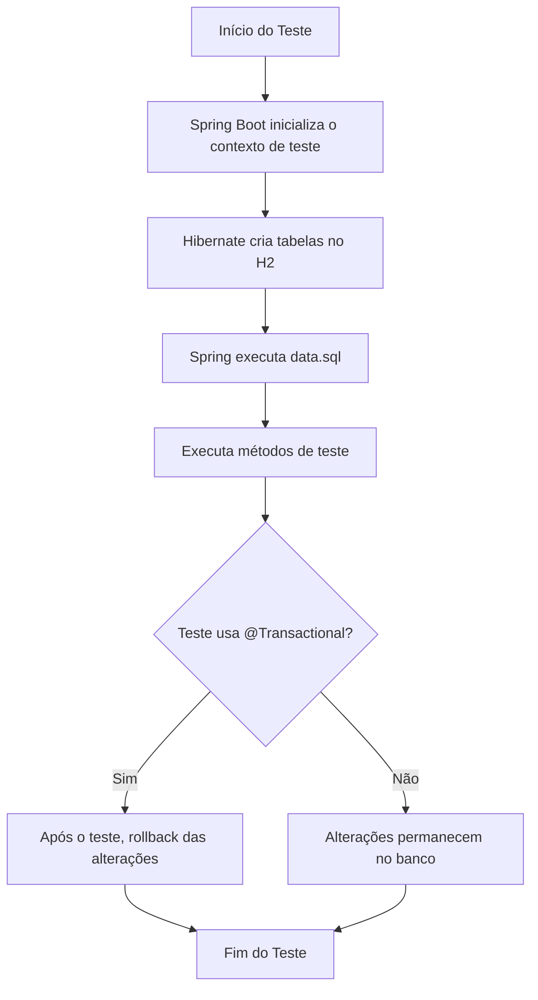

# 📦 Spring DB Test Demo

Este projeto demonstra como realizar **testes com banco de dados** no Spring Boot, utilizando:

- **JUnit 5**
- **@DataJpaTest**
- **@SpringBootTest**
- Banco em memória **H2**
- Popular dados de teste com `data.sql`
- Isolamento de transações com **@Transactional**

## 🚀 Funcionalidades

- Testes unitários de repositórios JPA
- Testes de integração de endpoints REST
- População automática do banco com `data.sql` no perfil de teste
- Rollback automático para manter isolamento entre os testes

## 📂 Estrutura de Pastas

```text
spring-db-test-demo/
├── src/main/java/com/example/springdbtestdemo/
│ ├── entity/Product.java
│ ├── repository/ProductRepository.java
│ ├── controller/ProductController.java
│ └── SpringDbTestDemoApplication.java
├── src/test/java/com/example/springdbtestdemo/
│ ├── ProductRepositoryTest.java
│ └── ProductControllerTest.java
├── src/test/resources/
│ ├── application-test.properties
│ └── data.sql
└── build.gradle.kts
```

## ⚙️ Configuração do Banco H2 (perfil `test`)
Arquivo `application-test.properties`:
```properties
spring.datasource.url=jdbc:h2:mem:testdb
spring.datasource.driver-class-name=org.h2.Driver
spring.datasource.username=sa
spring.datasource.password=

spring.jpa.hibernate.ddl-auto=create-drop
spring.jpa.defer-datasource-initialization=true
spring.sql.init.mode=always
spring.sql.init.platform=h2
spring.jpa.show-sql=true
```

## 🛠 Executando os Testes

Para rodar todos os testes:
```bash

./gradlew test

```

## 📊 Fluxo dos Testes com Banco de Dados




